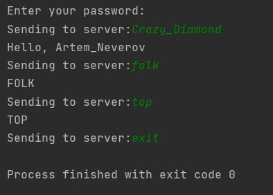
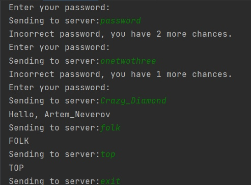
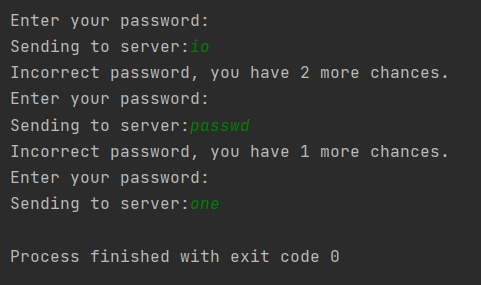

# echo_server

Базовые функции Эхо сервера реализованы в полной мере.

Реализованы дополнительные задания такие как:
1) Служебные сообщения, которые выводит сервер записываются в server.log)
2) Если потеряется соединение с сервером, то сервер продолжаетслушать порты. 
3) При вводе строки "exit" клиент отключается от сервера.
4) Идентифицирует пользователей, которые присоединяются на сервер (записывает их и требует при входе, пароли хешированы(реализовано с помощью SQLite3)).

---

Если пользователь подключается с определенного НОВОГО порта, то клиент предлагает ему зарегистрировать нового пользователя(Ввести логин и пароль)

---

Если пользователь заходит с уже известного порта, то сервер предлагает ввести только пароль(до 3-х попыток) 

---

При вводе неправильного пароля больше 2-ух раз клиен выходит и нужно заново перезаходить.

